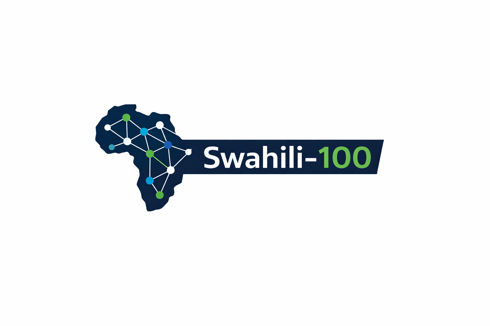

<p align="center">
  
</p>

<h1 align="center">Swahili-100</h1>

<p align="center">
  <strong>A from-scratch Swahili large language model. Everything built by hand. Everything under $100.</strong>
</p>

<p align="center">
  <a href="https://huggingface.co/marcoharuni95/swahili-100"></a>
  <a href="#license"></a>
  <a href="docs/COSTS.md"></a>
  <a href="docs/RESEARCH.md"></a>
</p>

<p align="center">
  <a href="https://x.com/marcoharuni">X</a> &middot;
  <a href="#">YouTube</a> &middot;
  <a href="docs/RESEARCH.md">Research Log</a> &middot;
  <a href="docs/COSTS.md">Cost Tracking</a>
</p>

---

## What Is This?

Swahili-100 is a language model built **entirely from scratch** — no imports from PyTorch's `nn.Transformer`, no pretrained tokenizers, no borrowed weights. Every component is hand-written:

- **Byte-Pair Encoding tokenizer** trained on Swahili text
- **Transformer architecture** with modern efficiency techniques (MLA, MoE, RoPE, RMSNorm, SwiGLU)
- **Custom optimizers** (AdamW and Muon)
- **FP8/BF16 mixed-precision training** with gradient accumulation
- **Flash Attention** implementation
- **KV-cache** and **speculative decoding** for inference
- **Multi-token prediction** training objective
- **Post-training alignment** pipeline
- **INT4/INT8 quantization** for deployment on CPU and edge devices

The entire pipeline — data collection, preprocessing, tokenizer training, model training, evaluation, alignment, and deployment — runs for under **$100** in total compute.

Swahili is spoken by over 100 million people across East Africa. There is no open-source, from-scratch language model purpose-built for Swahili. This project changes that.

---

## Why From Scratch?

Every line of code in this repository is written by hand. Not because libraries are bad — but because understanding every byte that flows through a language model is what separates an engineer from a user.

This project implements:

| Component | What We Build | What We Don't Import |
|---|---|---|
| Tokenizer | Full BPE with byte-fallback | No `sentencepiece`, no `tiktoken` |
| Embeddings | Token + rotary position encoding | No `nn.Embedding` wrappers |
| Attention | Multi-head, GQA, MLA, flash attention | No `nn.MultiheadAttention` |
| Normalization | RMSNorm with fused kernels | No `nn.LayerNorm` |
| Activation | SwiGLU feedforward | No `nn.GELU` |
| MoE | Top-k expert routing | No mixture-of-experts libraries |
| Optimizer | AdamW + Muon from first principles | No `torch.optim.AdamW` |
| Scheduler | Cosine with warmup | No `torch.optim.lr_scheduler` |
| Training | Distributed loop with grad accumulation | No `Trainer`, no `Accelerate` |
| Inference | KV-cache, speculative decoding | No `generate()` utilities |
| Quantization | INT4/INT8/FP8 | No `bitsandbytes` |
| Alignment | SFT + DPO pipeline | No `trl` |

This is the kind of project that **Karpathy's llm.c** and **minbpe** inspire — understanding through building.

---

## Project Status

> This project is under active development. Components are being built and validated incrementally.

| Phase | Description | Status |
|---|---|---|
| Phase 0 | Project setup, environment, tooling | `in progress` |
| Phase 1 | Data collection, cleaning, deduplication | `planned` |
| Phase 2 | BPE tokenizer training and validation | `planned` |
| Phase 3 | Model architecture implementation | `planned` |
| Phase 4 | Training infrastructure and full run | `planned` |
| Phase 5 | Evaluation and benchmarking | `planned` |
| Phase 6 | Alignment and post-training | `planned` |
| Phase 7 | Quantization, export, deployment | `planned` |
| Phase 8 | HuggingFace release and documentation | `planned` |

Follow the [Research Log](docs/RESEARCH.md) for detailed progress updates.

---

## Architecture

The model follows a decoder-only transformer design incorporating techniques from 2024-2026 research:

```
Input Token IDs
       │
       ▼
┌──────────────┐
│  Token Embed  │  (learned embeddings, no positional embedding added here)
└──────┬───────┘
       │
       ▼
┌──────────────────────────────────────────────┐
│              Transformer Block (×N)           │
│                                              │
│  ┌─────────┐    ┌──────────────────────────┐ │
│  │ RMSNorm │───▶│  Multi-Head Attention     │ │
│  └─────────┘    │  (GQA + RoPE + QK-Norm)  │ │
│                 │  (Flash Attention kernel)  │ │
│                 │  (KV-Cache for inference)  │ │
│                 └────────────┬───────────────┘ │
│                              │ + residual      │
│                              ▼                 │
│  ┌─────────┐    ┌──────────────────────────┐ │
│  │ RMSNorm │───▶│  SwiGLU FFN              │ │
│  └─────────┘    │  (or MoE with top-k)     │ │
│                 └────────────┬───────────────┘ │
│                              │ + residual      │
└──────────────────────────────┼───────────────┘
       │                       │
       ▼ (repeat N times)      │
┌──────────────┐               │
│   RMSNorm    │◀──────────────┘
└──────┬───────┘
       │
       ▼
┌──────────────┐
│  LM Head     │  (weight-tied with token embeddings)
└──────┬───────┘
       │
       ▼
  Logits (vocab_size)
  └──▶ Multi-Token Prediction heads (optional)
```

### Key Techniques

- **RoPE** — Rotary positional encoding applied to Q and K at each layer
- **GQA** — Grouped-query attention to reduce KV-cache memory
- **MLA** — Multi-head latent attention (DeepSeek-style compressed KV)
- **QK-Norm** — Normalizing Q and K for training stability
- **SwiGLU** — Gated FFN activation for improved parameter efficiency
- **MoE** — Optional mixture-of-experts routing for scaling without proportional compute
- **Flash Attention** — Fused attention kernel, tiling for O(N) memory
- **Multi-Token Prediction** — Predict multiple future tokens per position
- **FP8 Mixed Precision** — FP8 forward pass, BF16/FP32 master weights

---

## Data Pipeline

```
┌─────────────┐   ┌──────────────┐   ┌───────────────┐   ┌──────────────┐   ┌────────────┐
│  Raw Crawl   │──▶│  Lang Detect  │──▶│  Dedup (LSH)  │──▶│  Quality     │──▶│  Tokenize  │
│  (OSCAR,     │   │  (fastText)   │   │  (MinHash)    │   │  Filter      │   │  (BPE)     │
│   CC-100,    │   │               │   │               │   │  (perplexity,│   │            │
│   Wiki, etc) │   │               │   │               │   │   length,    │   │            │
│              │   │               │   │               │   │   encoding)  │   │            │
└─────────────┘   └──────────────┘   └───────────────┘   └──────────────┘   └────────────┘
```

### Sources

| Source | Est. Tokens | Quality | Notes |
|---|---|---|---|
| OSCAR Swahili | ~500M | Medium | Web crawl, heavy cleaning needed |
| CC-100 Swahili | ~300M | Medium | CommonCrawl subset |
| Wikipedia sw | ~50M | High | Clean, encyclopedic |
| News sites | ~100M | High | Contemporary written Swahili |
| Books / literature | ~50M | High | Formal register |
| **Target** | **1-2B** | | After dedup and filtering |

---

## Tokenizer

A custom Byte-Pair Encoding tokenizer trained exclusively on Swahili text.

**Why custom?** English-centric tokenizers (LLaMA, GPT) encode Swahili at 2-3x the token cost. Swahili is agglutinative — prefixes and suffixes carry grammatical meaning. A Swahili-native tokenizer captures these morphological patterns, achieving better compression and downstream performance.

| Property | Value |
|---|---|
| Algorithm | BPE with byte-fallback |
| Vocab size | Determined during training |
| Training data | Subset of cleaned Swahili corpus |
| Special tokens | `<\|bos\|>`, `<\|eos\|>`, `<\|pad\|>`, `<\|unk\|>` |
| Target compression | < 1.5 tokens/word |

---

## Training

### Compute Strategy

All training runs are tracked with transparent cost reporting in [docs/COSTS.md](docs/COSTS.md).

| Phase | Hardware | Purpose |
|---|---|---|
| Tokenizer | CPU | BPE training |
| Ablations | Free Colab / T4 | Hyperparameter search |
| Architecture | Rented GPU | Validate design choices |
| Final run | Rented GPU | Full training |
| Evaluation | CPU / free tier | Benchmarks |

### Training Features (All From Scratch)

- **AdamW optimizer** — Decoupled weight decay, bias correction
- **Muon optimizer** — Momentum-based update with orthogonalization
- **Cosine LR schedule** — With linear warmup
- **Gradient accumulation** — Simulate large batch sizes on small GPUs
- **Gradient checkpointing** — Trade compute for memory
- **FP8 mixed precision** — Forward in FP8, master weights in FP32
- **Gradient clipping** — Max-norm clipping for stability
- **Multi-token prediction** — Auxiliary heads for predicting future tokens

---

## Evaluation

### Intrinsic
- Perplexity on held-out Swahili text
- Bits-per-character (tokenizer-agnostic comparison)

### Downstream
- **MasakhaNER** — Swahili named entity recognition
- **AfriSenti** — Swahili sentiment analysis
- **Translation** — Swahili-English BLEU scores
- **Generation** — Human evaluation of text quality

### Baselines
- mBERT, XLM-R, AfroLM (multilingual models)
- GPT-4, Claude (API zero-shot, for reference)

---

## Inference

All inference code is written from scratch, including:

- **KV-cache** — Avoid recomputing past key-value pairs
- **Speculative decoding** — Draft-then-verify with a smaller model
- **INT4/INT8 quantization** — For CPU and edge deployment
- **ONNX export** — For cross-platform inference

### Deployment Targets
- Google Colab (free tier)
- Raspberry Pi 5 (INT4)
- Mobile (ONNX)
- HuggingFace Spaces

---

## Project Structure

```
swahili-100/
├── assets/                    # Images, diagrams
│   └── swahili-100-banner.png
├── configs/                   # Training and model configs
│   ├── swahili_base.yaml      # Base model config
│   ├── swahili_large.yaml     # Larger variant config
│   └── debug.yaml             # Fast iteration config
├── data/                      # Data pipeline
│   ├── __init__.py
│   ├── download.py            # Data acquisition scripts
│   ├── clean.py               # Text cleaning and normalization
│   ├── dedup.py               # MinHash LSH deduplication
│   ├── filter.py              # Quality filtering
│   ├── tokenizer.py           # BPE tokenizer (from scratch)
│   └── loader.py              # DataLoader and batching
├── model/                     # Model architecture
│   ├── __init__.py
│   ├── config.py              # Model configuration dataclass
│   ├── embedding.py           # Token embeddings
│   ├── rope.py                # Rotary position encoding
│   ├── norm.py                # RMSNorm
│   ├── attention.py           # Multi-head / GQA / MLA attention
│   ├── flash_attention.py     # Flash attention kernel
│   ├── feedforward.py         # SwiGLU FFN
│   ├── moe.py                 # Mixture of Experts
│   ├── block.py               # Transformer block
│   ├── transformer.py         # Full transformer model
│   ├── lm_head.py             # Language model head + MTP
│   └── generate.py            # Inference with KV-cache + speculative
├── training/                  # Training infrastructure
│   ├── __init__.py
│   ├── trainer.py             # Training loop
│   ├── adamw.py               # AdamW optimizer (from scratch)
│   ├── muon.py                # Muon optimizer (from scratch)
│   ├── scheduler.py           # LR schedulers
│   ├── precision.py           # FP8/BF16 mixed precision
│   ├── grad_accumulation.py   # Gradient accumulation
│   ├── grad_checkpoint.py     # Gradient checkpointing
│   └── loss.py                # Loss functions (CE + MTP)
├── alignment/                 # Post-training alignment
│   ├── __init__.py
│   ├── sft.py                 # Supervised fine-tuning
│   └── dpo.py                 # Direct preference optimization
├── evaluation/                # Evaluation suite
│   ├── __init__.py
│   ├── perplexity.py          # Perplexity and BPC
│   ├── ner.py                 # MasakhaNER evaluation
│   ├── sentiment.py           # AfriSenti evaluation
│   ├── translation.py         # Translation BLEU
│   └── generation.py          # Generation quality
├── quantization/              # Quantization and export
│   ├── __init__.py
│   ├── quantize.py            # INT4/INT8 quantization
│   └── export_onnx.py         # ONNX export
├── utils/                     # Shared utilities
│   ├── __init__.py
│   ├── logging.py             # Training logger (W&B compatible)
│   ├── checkpoint.py          # Save / load checkpoints
│   ├── profiler.py            # Performance profiling
│   └── distributed.py         # Multi-GPU utilities
├── scripts/                   # Entry-point scripts
│   ├── train.py               # Main training script
│   ├── train_tokenizer.py     # Tokenizer training script
│   ├── evaluate.py            # Evaluation script
│   ├── generate.py            # Text generation script
│   ├── align.py               # Alignment script
│   ├── quantize.py            # Quantization script
│   └── export.py              # Export script
├── tests/                     # Test suite
│   ├── __init__.py
│   ├── test_tokenizer.py      # Tokenizer tests
│   ├── test_attention.py      # Attention tests
│   ├── test_model.py          # Forward pass tests
│   ├── test_optimizer.py      # Optimizer tests
│   ├── test_training.py       # Training loop tests
│   └── test_generation.py     # Generation tests
├── notebooks/                 # Jupyter notebooks
│   ├── 01_data_exploration.ipynb
│   ├── 02_tokenizer_analysis.ipynb
│   ├── 03_training_colab.ipynb
│   └── 04_inference_demo.ipynb
├── docs/                      # Documentation
│   ├── SETUP.md               # Environment setup
│   ├── TRAINING.md            # Training guide
│   ├── RESEARCH.md            # Research log
│   └── COSTS.md               # Budget tracking
├── tokenizer/                 # Trained tokenizer artifacts (gitkeep)
├── checkpoints/               # Model checkpoints (gitignored)
├── logs/                      # Training logs (gitignored)
├── .gitignore
├── .gitkeep files
├── LICENSE
├── CONTRIBUTING.md
├── Makefile
├── pyproject.toml
├── requirements.txt
└── train.py                   # Top-level entry point
```

---

## Quick Start

```bash
# Clone
git clone https://github.com/marcoharuni/swahili-100.git
cd swahili-100

# Environment
python -m venv .venv
source .venv/bin/activate
pip install -r requirements.txt

# Train tokenizer
python scripts/train_tokenizer.py --config configs/swahili_base.yaml

# Train model (debug)
python train.py --config configs/debug.yaml

# Train model (full)
python train.py --config configs/swahili_base.yaml

# Generate text
python scripts/generate.py --prompt "Tanzania ni nchi" --max_tokens 200

# Evaluate
python scripts/evaluate.py --config configs/swahili_base.yaml --checkpoint checkpoints/latest.pt
```

---

## Cost Tracking

Every compute dollar is tracked transparently. See [docs/COSTS.md](docs/COSTS.md) for the live budget.

---

## Contributing

See [CONTRIBUTING.md](CONTRIBUTING.md) for guidelines.

---

## Citation

```bibtex
@misc{haruni2026swahili100,
  author       = {Marco Haruni},
  title        = {Swahili-100: A From-Scratch Swahili Language Model Under \$100},
  year         = {2026},
  howpublished = {\url{https://github.com/marcoharuni/swahili-100}}
}
```

---

## Acknowledgements

- [Andrej Karpathy](https://github.com/karpathy) — llm.c, minbpe, and the philosophy of building from scratch
- [Masakhane](https://www.masakhane.io/) — African NLP community and benchmarks
- [HuggingFace](https://huggingface.co/) — Model hosting

---

## License

[MIT](LICENSE)

---

<p align="center"><em>Kujenga AI kwa Afrika.</em></p>
<p align="center"><em>Building AI for Africa.</em></p>
